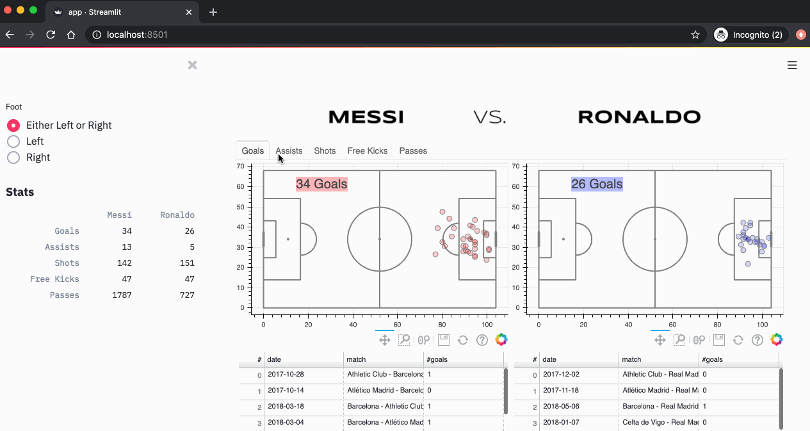

# Analyzing Messi and Ronaldo's Games using Python and Streamlit [](https://share.streamlit.io/adilmoujahid/streamlit-messi-ronaldo/master/app.py/+/)

* Source Code for my blog post: [Analyzing Messi and Ronaldo's Games using Python and Streamlit](http://adilmoujahid.com/posts/2020/06/streamlit-messi-ronaldo/)

<div style="display:block;margin:auto;height:80%;width:80%">
  
</div>

# Dependencies

- Works with ```Python 3.7``` 
- All Python dependencies are in ```requirements.txt```. You can install these dependencies by running the following command:

* ```pip install -r requirements.txt```

# Run the App

* From your terminal, execute: ```streamlit run app.py```
* Open ```http://localhost:8501``` in your browser

# References
[1] Pappalardo et al., (2019) A public data set of spatio-temporal match events in soccer competitions, Nature Scientific Data 6:236, https://www.nature.com/articles/s41597-019-0247-7

[2] https://figshare.com/articles/Events/7770599

# Visit my Blog : http://adilmoujahid.com